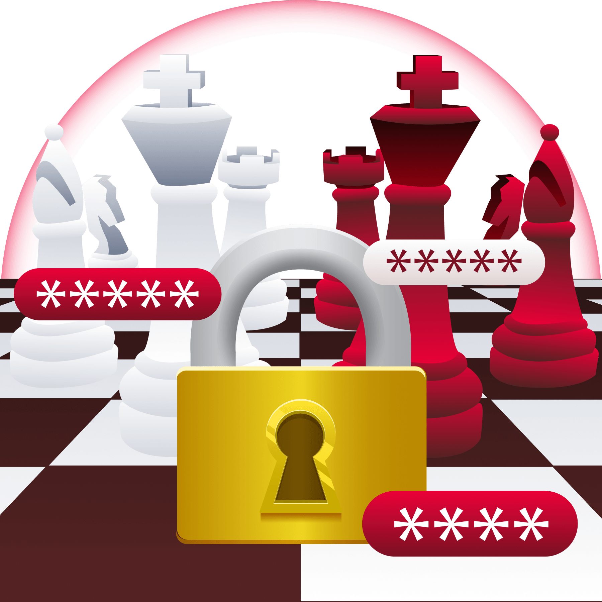

# Checkmate - Writeup

This room consists of five authentication challenges, each based on password discovery techniques. Every level provides a hint about how Marco's password was chosen, requiring increasingly targeted password attacks.

## Level 1

"Marco deployed a firewall at `firewall.thm:5001` but kept default credentials."

The first step was accessing the web application. This could be done either by adding the hostname to /etc/hosts or by connecting directly to the target IP and port.

The username field displayed "**admin**" as a placeholder, suggesting that it was the correct username.

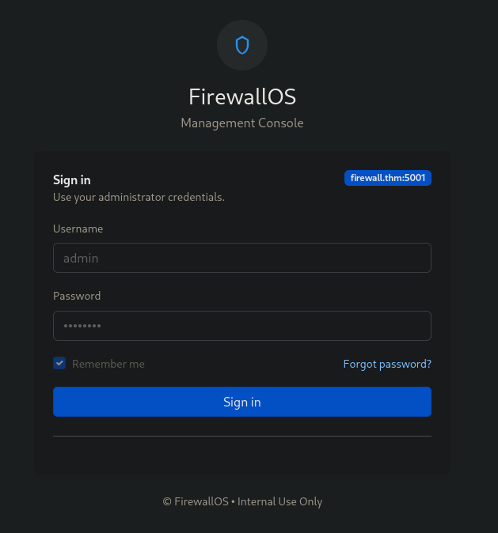

Since the challenge mentioned that the application was using **default credentials**, I used the **xato-net-10-million-passwords-100.txt** wordlist and performed a password brute-force attack using **Burp Suite**. After a short time, the correct password was identified, allowing me to proceed to the next level.

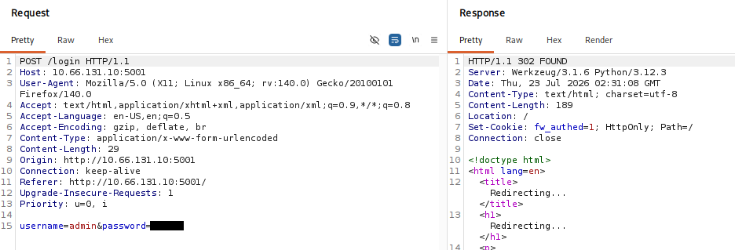

## Level 2

"Marco built an internal Employee Login panel on `jobs.thm:5002` and used common company keywords as passwords."

Instead of using a generic password list, I generated a targeted wordlist with **CeWL**, which crawls a website and extracts all visible words.

cewl http://IP:5002 > company.txt

I then used the generated wordlist with **ffuf** to brute-force the login form.

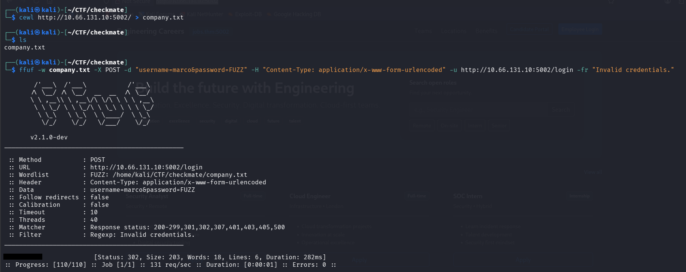

The correct password was successfully discovered, granting access to the next challenge.

## Level 3

"Navigate to `social.thm:5003` and derive Marco's password from personal information"

After logging into the previous application, I viewed Marco's employee profile and collected the personal information available there.

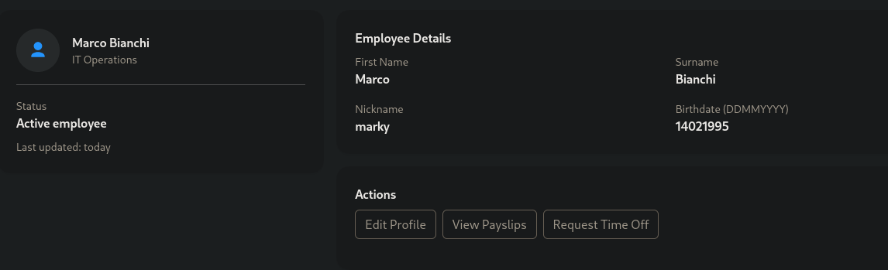

Using this information, I generated a customized password list with **CUPP**.

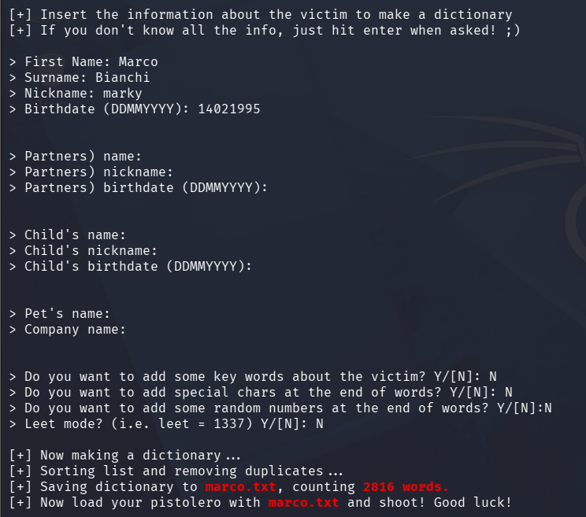

After answering the prompts with Marco's personal information, CUPP generated a wordlist named **marco.txt**.

I then used **Hydra** to brute-force the login page.

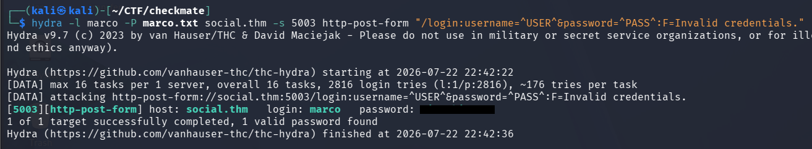

**Note**: The hostname `social.thm` had to be added to `/etc/hosts` before running Hydra.

The generated wordlist contained the correct password, allowing me to continue.

## Level 4

"On `social.thm:5003`, Marco recently uploaded a new profile picture. The platform renames uploaded files to the SHA-256 hash of the original filename."

While viewing Marco's profile, I opened the profile picture in a new browser tab and observed that its filename was a SHA-256 hash.

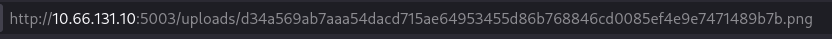

Following the hint, I saved the hash to a file and attempted to recover the original filename using **Hashcat** and the **rockyou.txt** wordlist.

`hashcat -m 1400 hash.txt /usr/share/wordlists/rockyou.txt`

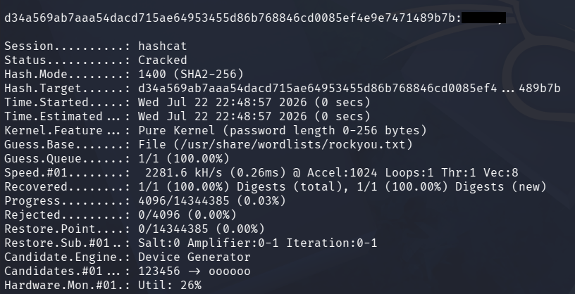

Hashcat successfully recovered the original filename, which was the required answer for this level.

## Level 5

"Marco has revealed his password pattern on `social.thm:5003`, using predictable rules based on keywords and formatting. Use this information to generate a targeted wordlist 
and brute-force the SSH service with username marco"

Marco had posted the following password creation strategy:

"I take a company keyword, capitalize it, then append the year like 2024 or any other number and an exclamation mark."

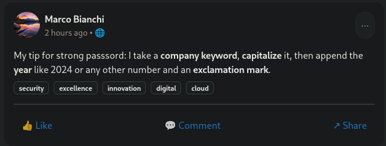

Since I already had a company-related wordlist (`company.txt`) from Level 2, I created a custom **Hashcat** rule to generate passwords following this pattern.

`echo 'c $2 $0 $2 $4 $!' > custom.rule`

This rule:

+ Capitalizes the first letter of each word (`c`)
+ Appends `2024!` to the end of each word

I generated a new wordlist using:

`hashcat --stdout -r custom.rule company.txt > marcostrongpass.txt`

Finally, I used the generated wordlist to brute-force the SSH service with Hydra.

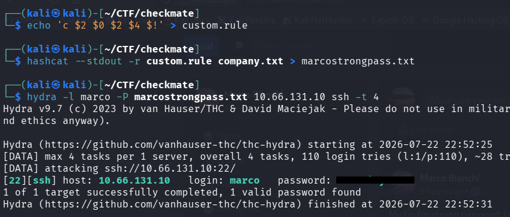

## Conclusion

This room demonstrates how weak password practices can be exploited through increasingly targeted attacks. Rather than relying solely on large generic wordlists, each level encouraged collecting information from the target environment and using it to build more effective password guesses.

Throughout the challenge, I used several common password auditing techniques and tools, including default credential testing, targeted wordlist generation with **CeWL** and **CUPP**, web login brute-forcing with **ffuf** and **Hydra**, and hash cracking with **Hashcat**. Overall, this room provides a good introduction to password attacks and highlights the importance of using strong, unique passwords that are not based on predictable patterns.
