# Daily Bugle writeup

Daily Bugle is a hard-difficulty TryHackMe room. The objective is to obtain both the **user** and **root** flags, as well as answer several questions throughout the room.

The attack chain involved SQL injection, exposed credentials, a Joomla template vulnerability, and a sudo misconfiguration.

## Initial Recon

I started with an Nmap scan to identify the services running on the target.

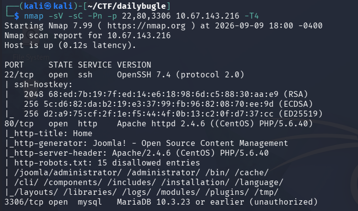

The scan revealed three open ports:

* **22** — SSH
* **80** — HTTP
* **3306** — MySQL/MariaDB

Since the machine was hosting a website, I decided to enumerate its directories using Gobuster.

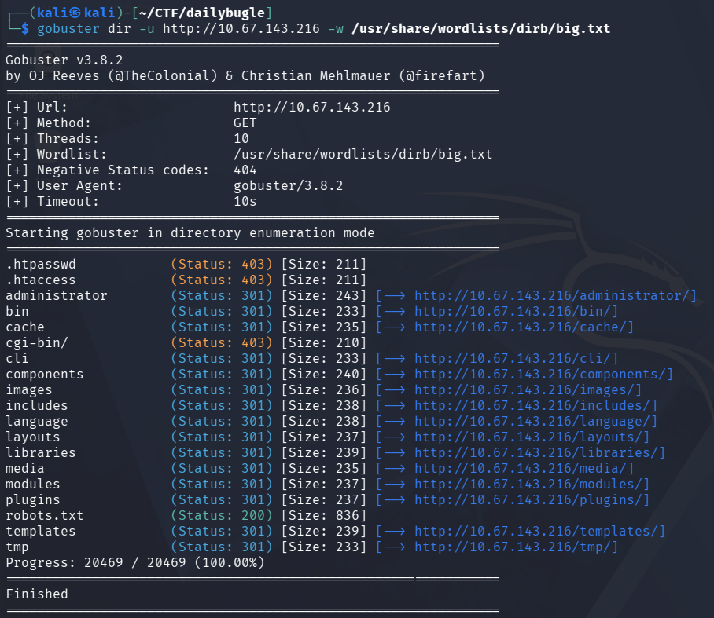

Gobuster discovered several directories, although most of them were inaccessible. One particularly interesting endpoint was:

`/administrator`

Accessing it revealed a **Joomla administrator login panel**.

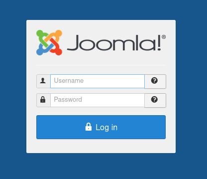

I did not have any credentials yet, but one of the room's questions asked for the **Joomla version**. Before trying to obtain credentials, I decided to determine which version was running.

## Joomla Enumeration

After searching for ways to identify the Joomla version, I found that the following path exposed the version information:

`/administrator/manifests/files/joomla.xml`

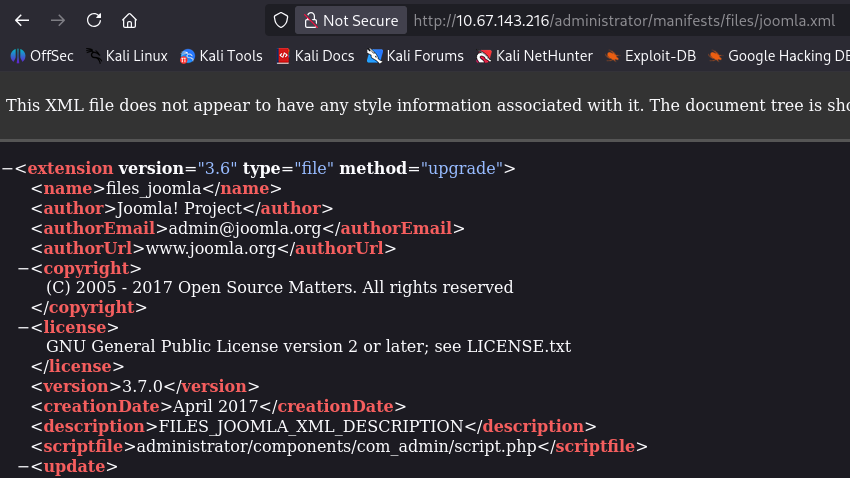

The file revealed that the target was running **Joomla 3.7.0**.

There were also easier ways to find this information, such as using the Nmap `http-joomla-version` script or a tool like `joomscan`.

## Searching for vulnerabilities

With the Joomla version identified, I searched for known vulnerabilities using `searchsploit`.

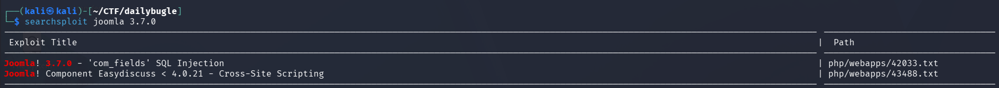

The search revealed **CVE-2017-8917**, which affects Joomla 3.7.0 and allows **SQL injection**.

This gave me a potential way to extract information from the Joomla database without having valid credentials.

## SQL Injection

My first attempt was to use `sqlmap`, but for some reason it was unable to retrieve the database columns I needed.

Instead of spending more time troubleshooting sqlmap, I decided to use a [Python script](https://github.com/BaptisteContreras/CVE-2017-8917-Joomla) specifically designed to exploit the vulnerability.

The script successfully extracted a password hash associated with the Joomla user:

`jonah`

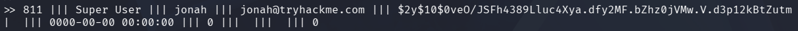

Looking at the format of the hash, I identified it as **bcrypt**.

With the hash type identified, I used John the Ripper with the `rockyou.txt` wordlist.

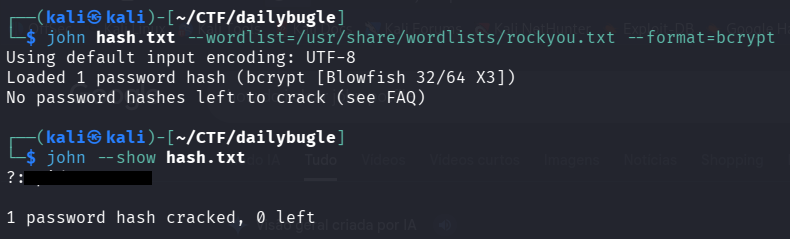

John successfully recovered Jonah's password.

## Initial Access

Now that I had valid credentials, I logged into the Joomla administrator panel at:

`/administrator`

While looking through the administrator functionality, I found an option to edit the website's templates.

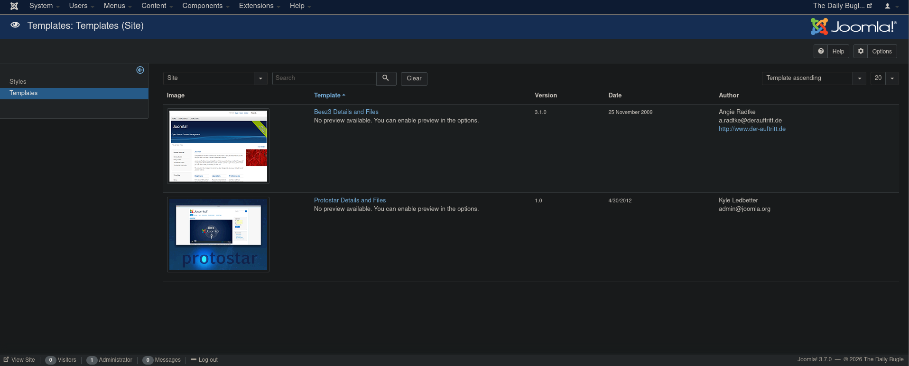

The template editor allowed me to modify PHP files, which immediately looked useful for obtaining code execution.

I decided to modify the `error.php` file and replace its contents with a PHP reverse shell.

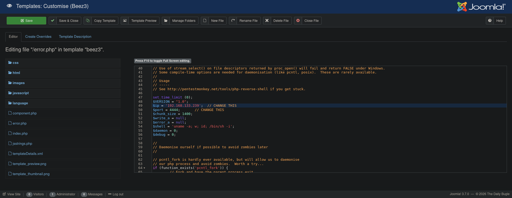

I started a listener on my machine and then accessed:

`http://TARGET_IP/templates/beez3/error.php`

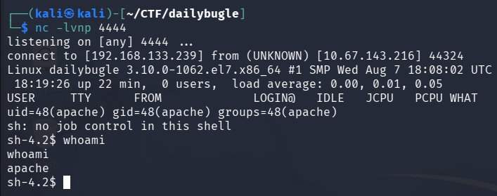

The PHP file was executed by the web server and I received a reverse shell.

I now had access to the machine as:

`apache`

## Obtaining the User Flag

After getting a shell, I started enumerating the filesystem.

Inside `/home/`, I found a directory belonging to another user:

`jjameson`

This looked like the location of the user flag, but my current apache account did not have permission to access it.

I therefore needed to find a way to obtain credentials for `jjameson`.

While looking through the web application's files, I found:

`/var/www/html/configuration.php`

The Joomla configuration file contained credentials that looked potentially useful.

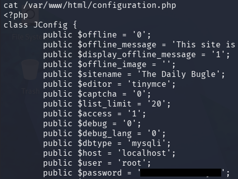

I decided to try these credentials for the `jjameson` account.

The credentials worked.

I was able to authenticate as `jjameson` through SSH and access the user's home directory grabbing the first flag.

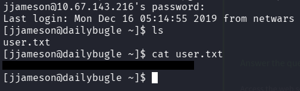

## Privilege Escalation

Instead of immediately transferring LinPEAS to the machine, I decided to perform some manual privilege escalation enumeration first.

The first command I checked was:

```bash
sudo -l
```

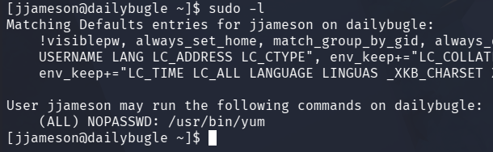

The output immediately revealed an interesting privilege:

`jjameson` could execute `/usr/bin/yum` as **root** without a password.

Since YUM can load plugins, I searched for a privilege escalation technique on GTFOBins and found a method that abuses its plugin functionality to execute Python code as root.

I followed the payload from GTFOBins and made a few adjustments to it for the target machine. Rather than creating each file manually with a text editor, I simply pasted the entire payload directly into the terminal.

The payload first created a temporary directory and then used `cat` with `<<EOF` to create the required YUM configuration and plugin files:

```bash
TF=$(mktemp -d)

cat >$TF/x<<EOF
[main]
plugins=1
pluginpath=$TF
pluginconfpath=$TF
EOF

cat >$TF/y.conf<<EOF
[main]
enabled=1
EOF

cat >$TF/y.py<<EOF
import yum
import os
from yum.plugins import PluginYumExit, TYPE_CORE, TYPE_INTERACTIVE
requires_api_version='2.1'

def init_hook(conduit):
  os.execl('/bin/sh','/bin/sh')
EOF
```

The Python plugin uses `os.execl()` to replace the current process with `/bin/sh`. Since YUM was being executed with root privileges, the resulting shell would also run as root.

Finally, I executed:

```bash
sudo yum -c $TF/x --enableplugin=y
```

This successfully gave me a root shell.

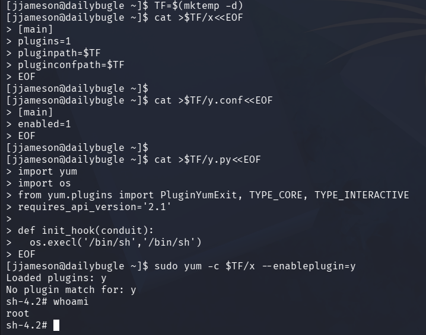

I could now access the root flag.

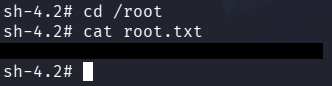

## Conclusion

Daily Bugle was a good example of chaining several vulnerabilities and misconfigurations together to obtain full system access.

The initial Joomla SQL injection allowed me to recover Jonah's credentials, which provided access to the administrator panel. From there, modifying a PHP template gave me a reverse shell as apache. Credentials exposed in the Joomla configuration file could then be reused to access `jjameson` through SSH.

For privilege escalation, `sudo -l` revealed that `jjameson` could execute YUM as root. By abusing YUM's plugin functionality to execute Python code, I was able to obtain a root shell and retrieve the final flag.
