# Operation Coldstart - Writeup

Operation Coldstart is a Linux-based room focused on chaining multiple small weaknesses into full system compromise. The attack path involves anonymous FTP access, source code disclosure, access to internal resources through a URL preview functionality, and a privilege escalation caused by an insecure cron job using `tar` with an unquoted wildcard.

## Reconnaissance

I started with an Nmap scan to identify the exposed services running on the target.

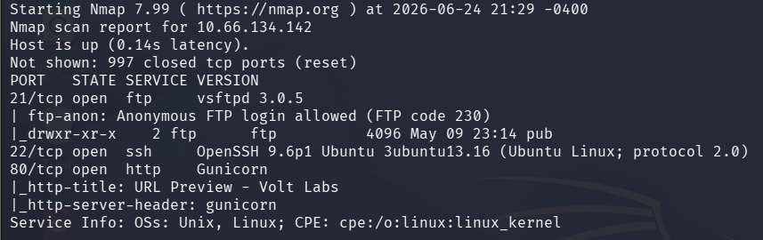

The scan revealed three open ports:

+ 21/tcp — FTP
+ 22/tcp — SSH
+ 80/tcp — HTTP

Two details immediately stood out during enumeration:

+ The FTP service allowed anonymous authentication (Anonymous FTP login allowed)
+ The HTTP title identified the application as a URL Preview Service (Strongly hinting a possible SSRF attack)

## Web Enumeration

After identifying the web service, I began enumerating the application directories using Gobuster.

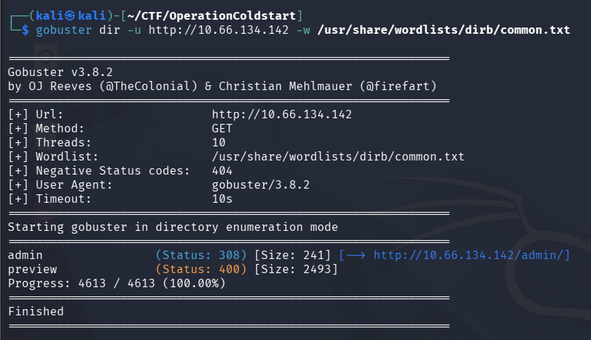

During the scan, Gobuster revealed an interesting endpoint:

`/admin/`

Attempting to access the directory directly resulted in an access denied response.

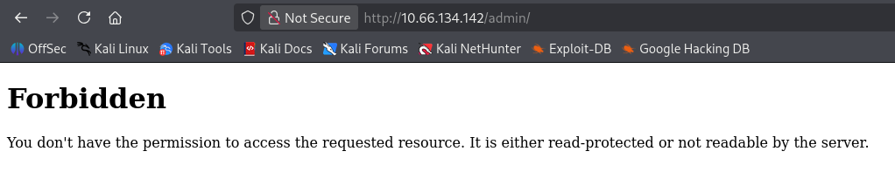

## FTP Enumeration

Since direct access to the /admin directory was not possible, I decided to further investigate the FTP service.

While enumerating the available files, I discovered a compressed backup archive named:

`backup.tar.gz`

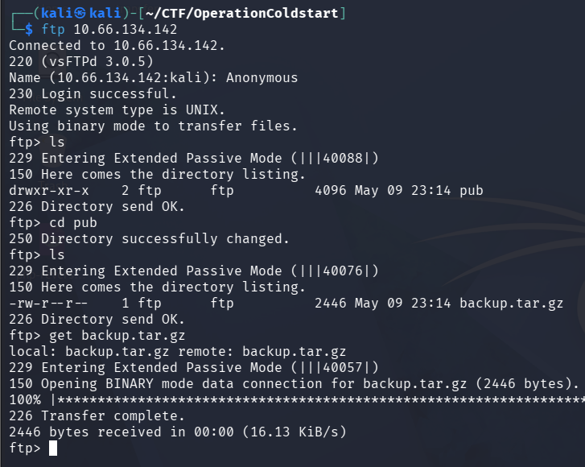

## Source Code Analysis

After downloading the backup archive, I extracted its contents and began reviewing the application files.

Inside the backup, I found the main Flask application source code in a file named:

`app.py`

While reviewing the code, I identified the following configuration:

ALLOWED_HOSTS = {"kestrel.thm"}

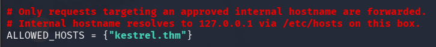

Further down in the source code, I found an interesting administrative route:

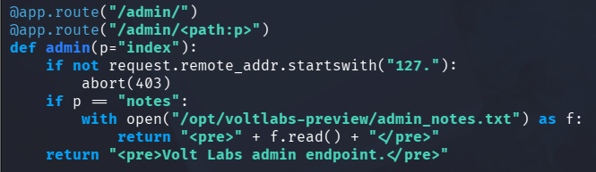

The source code revealed two critical details:

+ Local-Only Access: The `/admin` endpoint enforces a restriction (`127.x.x.x`) to ensure it can only be accessed locally.
+ Sensitive Target: Accessing the `/admin/notes` path triggers the server to read and display the contents of `admin_notes.txt`.

Since the application processes server-side requests via its URL preview functionality, this behavior strongly suggested that the internal administrative endpoint could be accessed indirectly.

## Exploiting SSRF

Because the application implicitly trusts internal routing, we can abuse Server-Side Request Forgery (SSRF) by forcing the server to issue an HTTP request to its own loopback interface. 

By manipulating the URL preview input to target:

`http://kestrel.thm/admin/notes`

The server processes the request internally. This causes the application to satisfy its own local IP validation, effectively bypassing the external access restrictions.

Since the request originates from the server itself, the application successfully reads and renders the `admin_notes.txt` file in the response. This file disclosed highly sensitive administrative credentials, specifically:

+ A valid SSH username
+ The corresponding SSH password

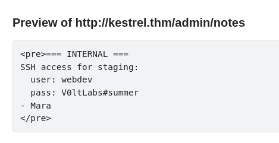

## User Flag

Using the recovered credentials, I connected through SSH and got the user flag.

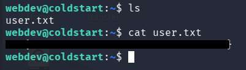

## Local Enumeration & Privilege Escalation Vector

After gaining initial access as the `webdev` user, the next objective was to escalate privileges to `root`. 

I started by checking for basic sudo permissions using `sudo -l`; however, the user did not possess any sudo privileges. Moving forward with local enumeration, I manually inspected the system's cron jobs to find scheduled tasks that might be running with higher privileges.

Inside the `/etc/cron.d/` directory, I discovered an interesting custom cron job named `voltlabs-backup`:

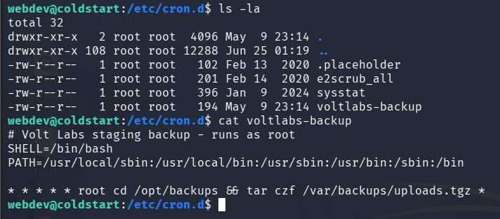

## Vulnerability Analysis

This specific configuration presents a critical privilege escalation vector due to two main factors:

1. **High Privileges:** The job is explicitly configured to execute every minute as the `root` user.
2. **Wildcard Injection:** The command uses a wildcard (`*`) at the end of the `tar` execution inside the `/opt/backups` directory. 

If the `webdev` user has write permissions inside `/opt/backups`, this wildcard usage allows for a **Tar Wildcard Injection** attack. By creating files with specific names that mimic `tar` command-line arguments (such as `--checkpoint`), we can trick the system into executing arbitrary commands as `root` when the cron job triggers.

## Exploitation: Tar Wildcard Injection

To verify if the `webdev` user could exploit this configuration, I first checked the permissions of the `/opt/backups` directory using `ls -ld`.

The output confirmed full write permissions (`drwxrwx---`) for the `webdev` group, allowing us to proceed with the wildcard exploitation. 

The attack works by creating a malicious script and manipulating `tar` via argument injection. When the cron job expands the wildcard (`*`), it processes files starting with dashes (`--`) as command-line arguments instead of regular filenames.

I executed the exploitation step-by-step as follows:

1. **Creating the Malicious Script:** I created a shell script named `shell.sh` that copies the standard bash binary to `/tmp` and applies the SUID bit (`chmod +s`). The SUID permission causes the file to execute with the privileges of its owner (`root`) rather than the user running it:

```echo 'cp /bin/bash /tmp/bash && chmod +s /tmp/bash' > shell.sh```

2. **Injecting Tar Parameters:** To force `tar` to execute our script, I needed to create two specific checkpoint files. These filenames act as arguments that change `tar`'s execution behavior:

+ `--checkpoint=1`: Instructs `tar` to trigger a status checkpoint after processing every single file.
+ `--checkpoint-action=exec=sh shell.sh`: Instructs `tar` to execute our custom shell script as a system command whenever a checkpoint is reached.

Since the `touch` command naturally interprets arguments starting with dashes as flags, I used the double-dash (`--`) delimiter to signal the end of command options and successfully create the filenames:

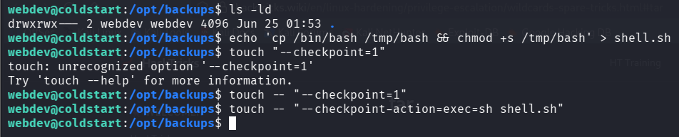

## Spawning Root Shell & Capturing Root Flag

After waiting a minute for the cron job to trigger the checkpoint action and execute `shell.sh` as `root`, the SUID bash binary was successfully created in the temporary directory.

To obtain the administrative shell, I executed the newly created binary with the `-p` flag:

```/tmp/bash -p```

The `-p` (privileged) flag is crucial here; without it, bash would naturally drop its SUID privileges and revert the effective user ID back to the low-privileged `webdev` user. By preserving the root privileges, a root shell (`bash-5.2#`) was successfully spawned and the root flag captured, completing the challenge.

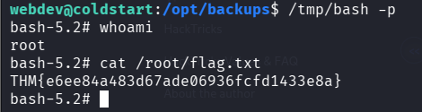

## Conclusion

This machine involved chaining multiple weaknesses together:

+ Anonymous FTP access
+ Exposure of application source code
+ Access to internal resources through the preview functionality
+ SSH credential disclosure
+ Tar Wildcard Injection in a root cron job

The privilege escalation vulnerability was caused by the unsafe use of the wildcard * in combination with the tar command, allowing user-controlled filenames to be interpreted as command-line arguments and ultimately leading to arbitrary command execution as root.
