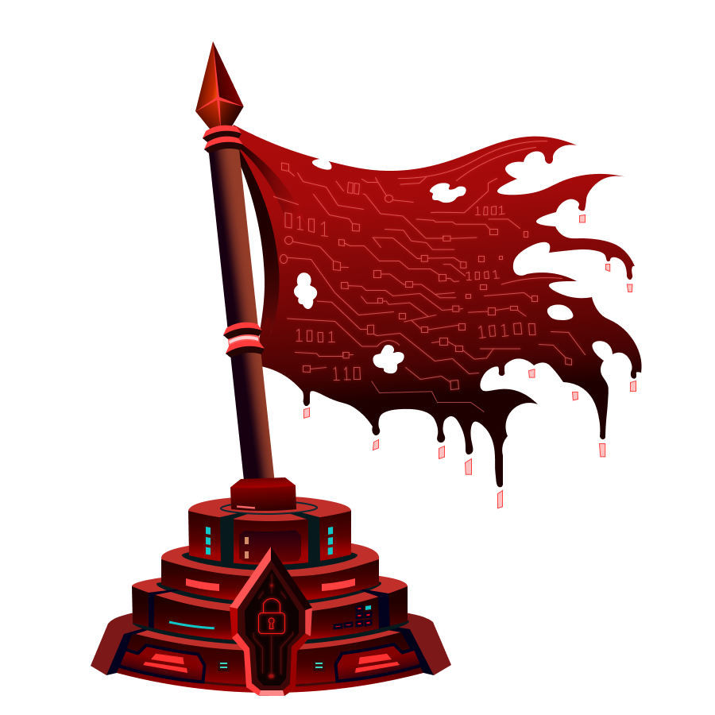

# Silent Monitor - Write-up

Silent Monitor is a medium-difficulty TryHackMe room where the objective is to obtain both the **user** and **root** flags.

## Initial Recon

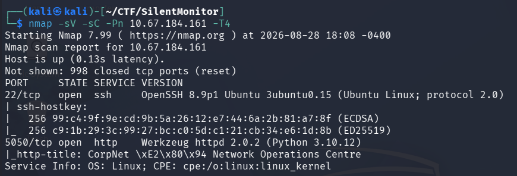

The Nmap scan revealed two interesting open ports:

* **22** — SSH
* **5050** — HTTP

The website running on port 5050 did not seem to have anything particularly interesting at first. I could not access any useful functionality or even find a login panel, so I decided to perform directory enumeration with Gobuster.

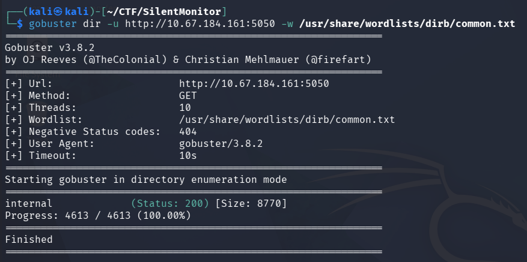

Gobuster discovered an interesting endpoint:

`/internal`

This endpoint contained a login panel with an **"operator id"** field.

In CTFs, a simple username field like this can sometimes be a good indication that brute-forcing might be involved. However, before trying to brute-force anything, I decided to test the login field for SQL injection.

The SQL injection worked.

## SQL Injection

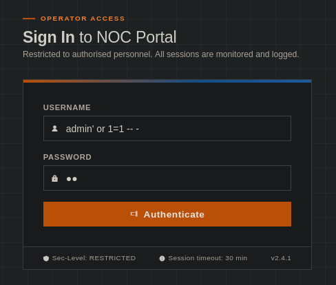

After bypassing the login, I gained access to a dashboard that appeared to be a **Host Health Check** application.

The application allowed me to test whether a host was reachable by performing a ping.

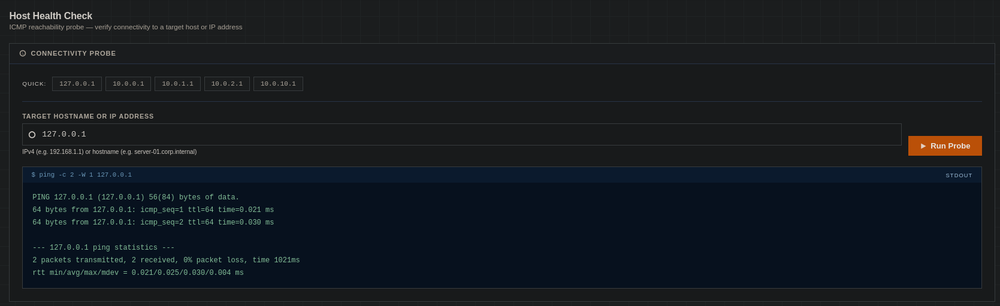

While looking through the dashboard, I also checked the **audit log**. There I noticed some suspicious activity.

One of the logged requests contained:

`127.0.0.1%0awhoami`

The `%0a` represents a newline character. Seeing a command such as `whoami` being appended to a ping request suggested that the application might be vulnerable to **command injection**.

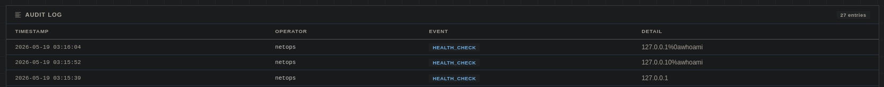

I tried to reproduce the same payload directly through the web interface, but it did not work.

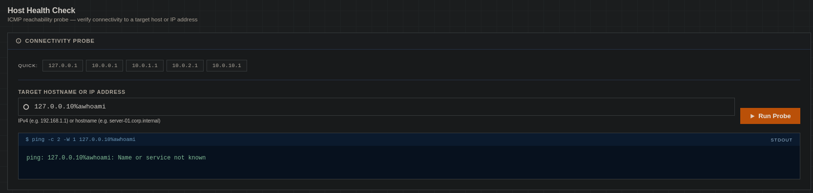

After trying a few different bypass techniques, I decided to inspect the request using **Burp Suite**.

Eventually, I managed to bypass the application's filtering and get it to execute my test command.

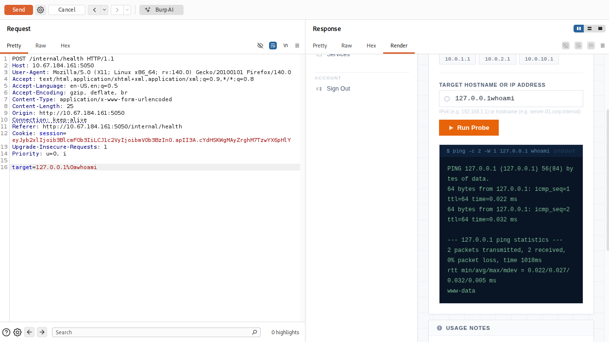

At this point, I had confirmed that I could execute commands on the target machine.

## Getting a Reverse Shell

With command execution confirmed, the next step was to obtain a proper shell.

I decided to use a **BusyBox netcat reverse shell** and sent the payload through Burp Suite.

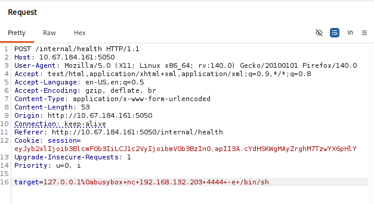

After receiving the connection, I obtained a shell as the `www-data` user.

## Finding SSH Credentials

While enumerating the machine as `www-data`, I found a file named:

`secret.config`

Reading the file revealed credentials that could be used to access the machine through SSH.

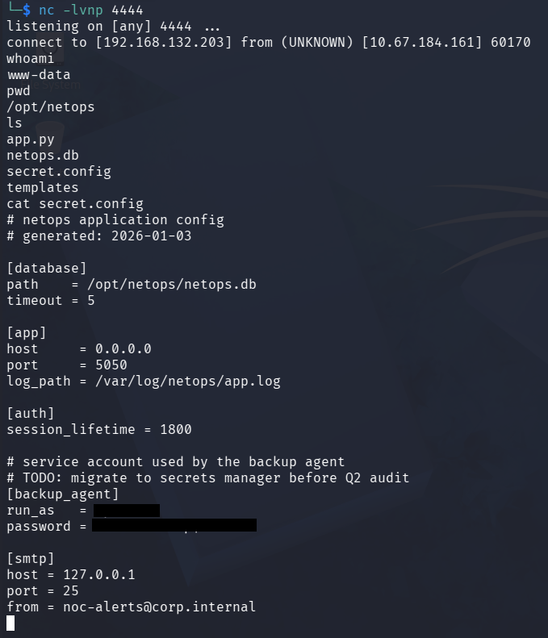

I used the credentials to connect through SSH.

Once logged in, I was able to obtain the **user flag**.

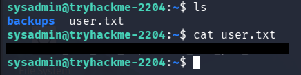

## Privilege Escalation

While looking through the user's directory, I found another directory named `backups`.

Inside it was a file with the `.kdbx` extension.

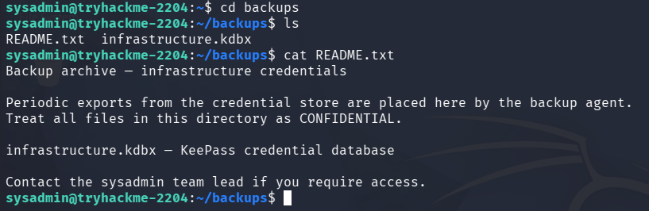

A `.kdbx` file is a **KeePass database**, which is commonly used as a password manager. This immediately looked interesting because it could potentially contain credentials for other users.

I decided to transfer the database to my local machine using `scp`.

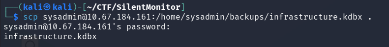

After doing some research, I found a tool called **bfkeepass.py**, which can be used to brute-force KeePass database passwords.

I downloaded the tool directly from [GitHub](https://github.com/toneillcodes/brutalkeepass/) using `wget`.

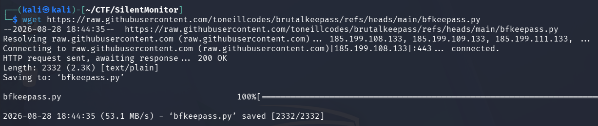

I then ran the tool against the KeePass database using the `rockyou.txt` wordlist.

It quickly found the database password.

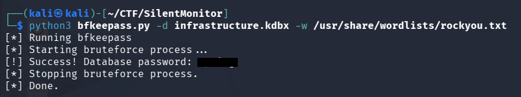

## Root Access

With the KeePass database unlocked, I inspected its contents and found credentials belonging to the **root** user.

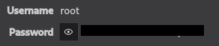

I used those credentials to log in as root.

Finally, I was able to access the **root flag**.

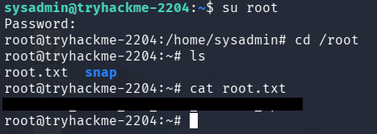

## Conclusion

Silent Monitor was a good example of how multiple vulnerabilities and misconfigurations can be chained together to obtain full system access.

The initial SQL injection allowed access to the internal dashboard, where a command injection vulnerability was discovered in the host health check functionality. This provided a shell as www-data, from which SSH credentials were recovered from a configuration file.

After obtaining user access, a KeePass database was found in a backup directory. Brute-forcing the database revealed the root credentials, allowing full administrative access to the machine.
