# Support - Writeup

Support is a Medium-difficulty TryHackMe room focused on web application testing. The objective is to obtain two flags: one by gaining administrator access to the application, and another by abusing a vulnerable administrative feature to read a file from the underlying operating system.

This writeup covers the complete attack path, including reconnaissance, brute forcing weak credentials, reviewing exposed PHP source code, bypassing authorization checks, identifying insecure password practices, and exploiting command injection to read arbitrary files.

## Enumeration

The initial Nmap scan revealed only two open ports.

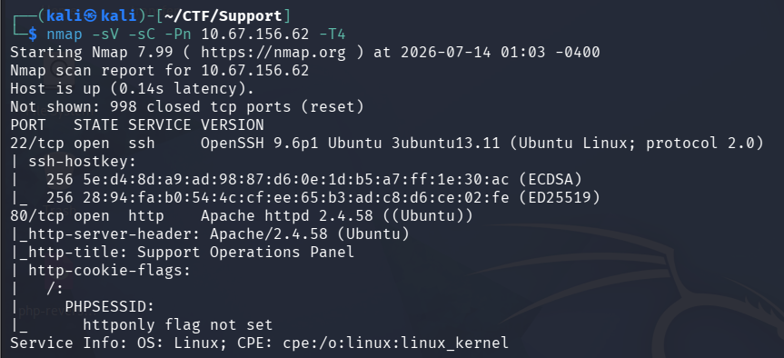

With only SSH and a web application exposed, the assessment focused on the HTTP service.

## Web Enumeration

Browsing the website revealed a login form.

Before attempting to enumerate credentials, I checked whether the application implemented any brute-force protection by repeatedly submitting invalid credentials. Every failed attempt returned the same "**Invalid credentials**" message without triggering HTTP **429 Too Many Requests** responses or any noticeable rate limiting, suggesting that password brute forcing was possible.

The login page also displayed the email address:

`help@support.thm`

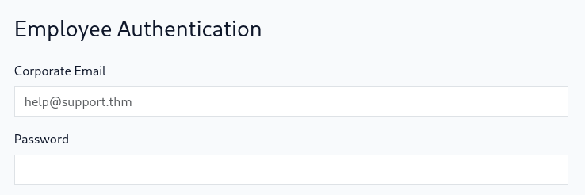

Since a valid username was already known, it became a good candidate for a password attack.

Running Gobuster against the web server did not initially reveal anything particularly interesting. Most discovered PHP files were inaccessible without authentication.

## Initial Access

Knowing that the application did not implement rate limiting, I used ffuf to brute force the password for help@support.thm.

`ffuf
-w /usr/share/wordlists/seclists/Passwords/Common-Credentials/10k-most-common.txt
-X POST
-d "email=help@support.thm&password=FUZZ"
-H "Content-Type: application/x-www-form-urlencoded"
-u http://TARGET
-fr "Invalid credentials"`

The brute-force attack successfully recovered the password:

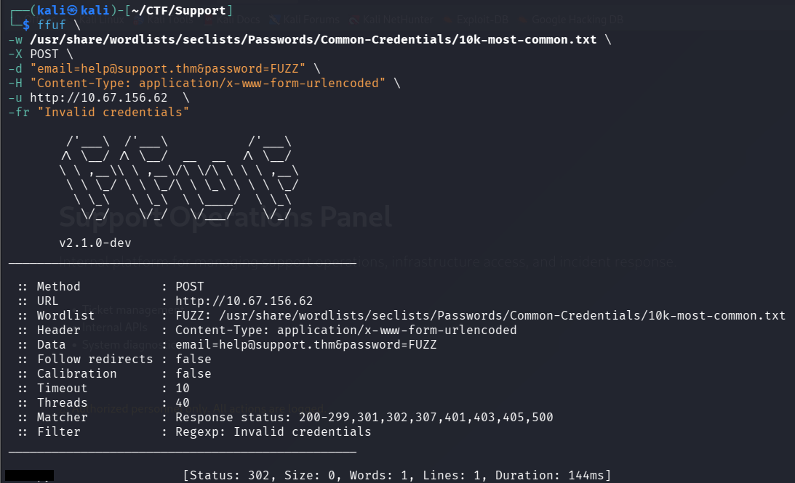

Logging into the application provided access to the user dashboard.

## Dashboard Enumeration

Inside the dashboard, I noticed that changing the site's color theme appended a parameter to the URL:

`?skin=`

Since user-controlled file names are commonly used for theme selection, this immediately suggested a potential Local File Inclusion (LFI) vulnerability.

However, after several attempts, I was unable to make meaningful progress through this parameter.

Instead, I returned to content discovery.

## Discovering Exposed PHP Source Files

A second Gobuster scan was performed, this time searching specifically for PHP files.

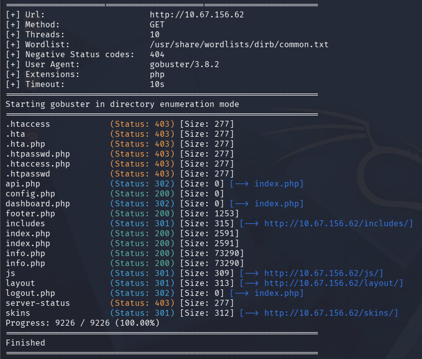

This scan identified several interesting files:

+ api.php
+ config.php
+ footer.php
+ index.php

Since the dashboard accepted the `skin` parameter, I experimented with directory traversal by supplying `../` followed by the discovered filenames.

Although the application itself did not visibly display any output, inspecting the page source (`view-source:`) revealed that the contents of the requested PHP files were being embedded directly into the HTML response instead of being executed by the server.

This unintentionally exposed the application's source code and several sensitive implementation details.

## Reviewing the Source Code

The first interesting finding came from **footer.php**.

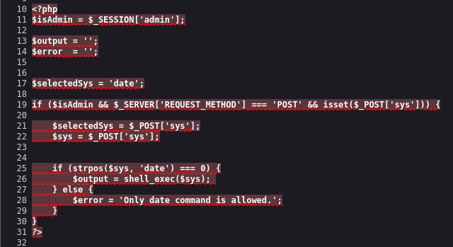

The application accepts a POST parameter named **sys**.

Instead of validating the entire command, it only checks whether the supplied string begins with date.

If the condition is satisfied, the entire string is passed directly to **shell_exec**().

Since `shell_exec()` invokes the system shell, shell metacharacters such as `;` are interpreted as command separators. This makes it possible to execute arbitrary commands after the initial `date` command, resulting in a classic command injection vulnerability.

At this point, however, the functionality was restricted to administrators.

The configuration file exposed another useful piece of information.

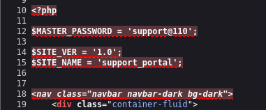

Although this password was not immediately usable, it later became an important clue.

Reviewing **index.php** suggested that administrator privileges were determined through a cookie whose value was compared against the MD5 hash of the string "**true**".

The implementation in **api.php** confirmed this.

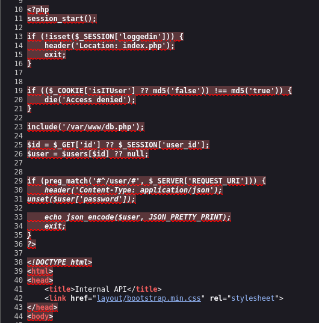

Instead of securely signing or validating the cookie, the application simply compared its value against `md5("true").`

By generating the MD5 hash of the string **true** and replacing the cookie value, I successfully bypassed the authorization check and gained access to the API.

## Enumerating Users

Once authenticated to the API, the endpoint documentation indicated that user information could be retrieved using:

/user/3

The returned profile confirmed that my account was not an administrator.

Querying another user ID proved more interesting.

/user/1

This response revealed the administrator account:

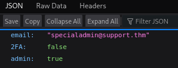

## Password Guessing

The password recovered from **config.php** appeared to be a master password.

I first attempted to authenticate using:

`specialadmin@support.thm
support@110`

This failed.

Rather than immediately launching another large brute-force attack, I suspected that the administrator password might simply be a variation of the exposed master password.

To generate realistic candidates, I created a context-aware wordlist using Hashcat's **dive.rule**.

`echo "support@110" > base.txt`

`hashcat --stdout base.txt -r /usr/share/hashcat/rules/dive.rule > passwords.txt`

Running the generated list against the login page eventually recovered the administrator password:

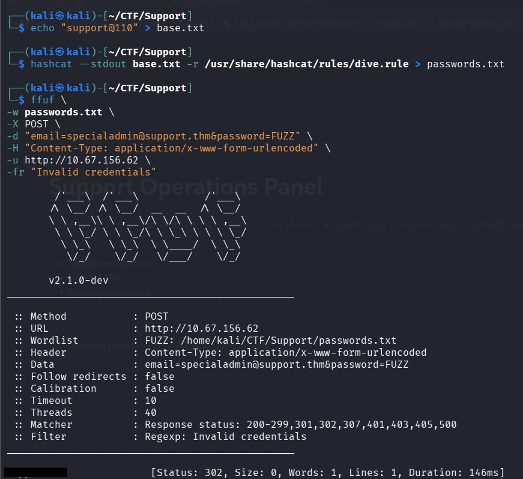

Logging in as the administrator yielded the first flag.

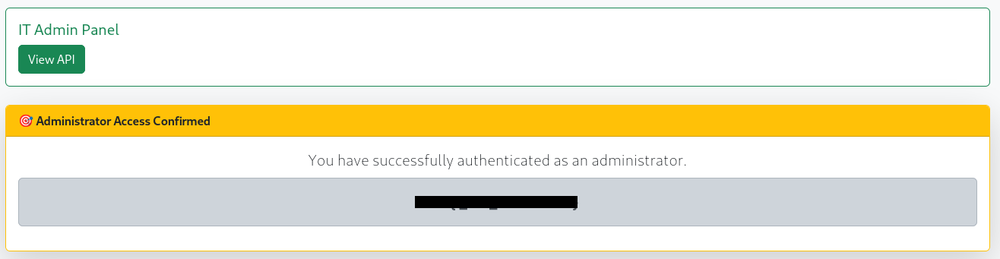

## Command Injection

Earlier source code analysis had already identified a command injection vulnerability within **footer.php.**

The dashboard source also revealed the expected parameter:

`<select name="sys">`

along with its default value:

`date +"%H:%M:%S"`

Although the dashboard normally issued a **GET** request, the vulnerable code in `footer.php` only handled **POST** requests. Instead of using Burp Suite, I modified the request directly from the browser's Developer Tools (**F12 → Network**).

I edited the request by changing the HTTP method to **POST**, adding the following header:

`Content-Type: application/x-www-form-urlencoded`

and supplying the following request body:

`sys=date; cat /home/ubuntu/user.txt`

Because the application only verified that the supplied input began with `date` before passing the entire string to `shell_exec()`, the semicolon (`;`) was interpreted by the shell as a command separator. As a result, the injected `cat` command was executed immediately after the legitimate `date` command.

The server returned the contents of:

`/home/ubuntu/user.txt`

which contained the second flag.

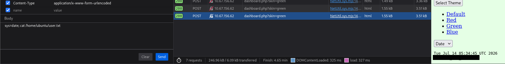

## Conclusion

This room demonstrates how multiple low-severity issues can combine into a complete compromise of a web application.

The attack chain began with weak authentication controls that allowed password brute forcing, followed by exposed PHP source code that revealed sensitive implementation details. Those disclosures enabled an authorization bypass through a predictable cookie, exposed hardcoded credentials that facilitated password guessing, and ultimately led to administrator access. Finally, insufficient validation of user input in a call to `shell_exec()` resulted in command injection, allowing arbitrary command execution and disclosure of sensitive files.

Overall, the room highlights the importance of implementing proper rate limiting, protecting source code, avoiding client-side trust for authorization, securely managing credentials, and validating user input before invoking system commands.
