# Wonderland - Writeup

Wonderland is a medium-difficulty TryHackMe room based on the fairytale *Alice in Wonderland*. The goal is to obtain both the **user** and **root** flags.

The room covers several interesting topics, including **credentials hidden in web directories, Python library hijacking, PATH hijacking, SUID binaries, and privilege escalation through Linux capabilities**.


## Nmap scan

I started with an Nmap scan to identify the services running on the target.

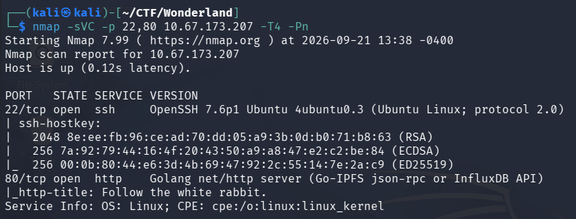

The scan revealed two open ports:

* **22** — SSH
* **80** — HTTP

Since there was a web server running, I decided to take a look at the website before starting directory enumeration.

## Web Enumeration

The website contained an image of a **White Rabbit**.

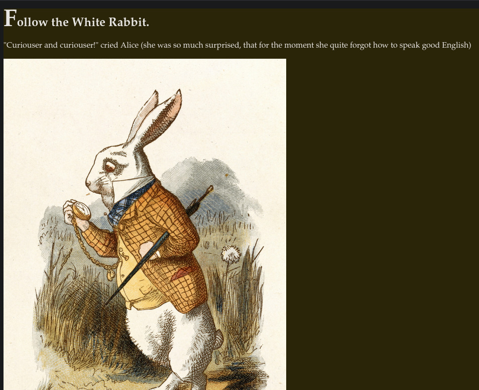

Since CTFs sometimes hide information inside images using steganography, I decided to download the image and inspect it with `steghide`.

I ran:

```bash
steghide info whiterabbit.jpg
```

The output revealed an embedded file called:

`hint.txt`

Reading the file gave me the following hint:

> `follow the r a b b i t`

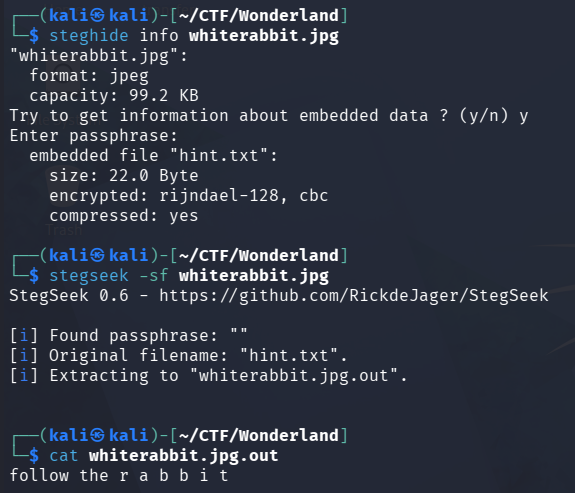

This suggested that there was probably more to discover through directory enumeration.

## Gobuster

I ran Gobuster to search for hidden directories.

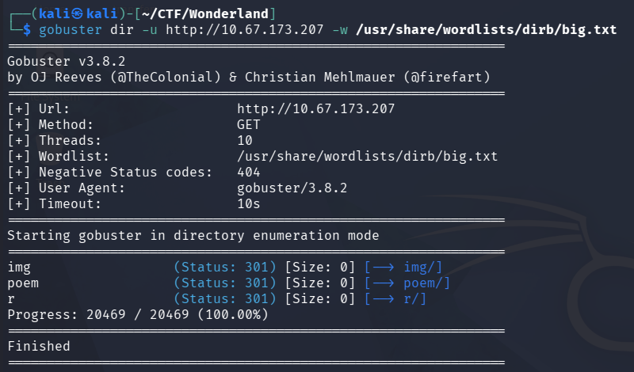

The scan revealed several interesting directories:

* `/img`
* `/r`
* `/poem`

I downloaded the images found under `/img` and checked them for embedded data as well, but nothing useful was found.

The `/poem` directory did not seem to contain anything interesting either.

However, `/r` immediately stood out.

## Following the Rabbit

Accessing `/r/` returned a simple message:

> `keep going.`

It also contained:

> `would you tell me, please, which way i ought to go from here?`

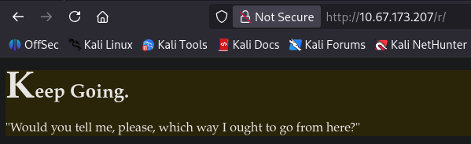

At this point, I connected this back to the `hint.txt` file we found earlier:

`follow the r a b b i t`

This looked like a sequence of directories rather than simply a reference to the White Rabbit.

So I tried following the letters:

`/r/a/b/b/i/t`

The directory existed.

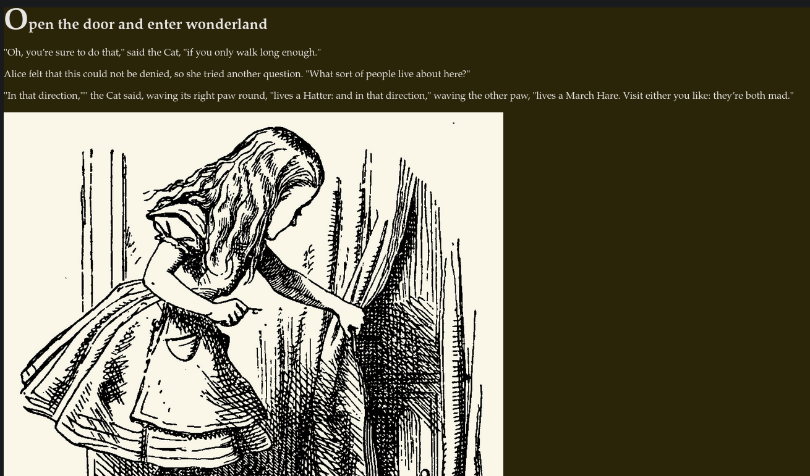

Besides a poem, I inspected the page source and found what appeared to be **SSH credentials**.

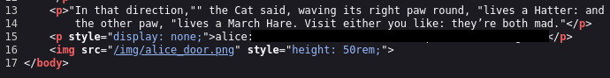

I tried using these credentials to connect to the SSH service on port 22.

The credentials worked, giving me a shell as the user:

`alice`

## User Enumeration

Once inside the machine, I checked Alice's home directory.

I found two interesting things:

* `root.txt`
* `walrus_and_the_carpenter.py`

The root flag was present, but I did not have permission to read it yet.

The Python script was owned by `root`.

I then checked Alice's sudo permissions:

```bash
sudo -l
```

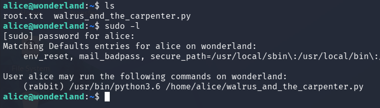

The output showed that Alice could execute the Python script as the user:

`rabbit`

This suggested that the intended path was to first escalate from **alice → rabbit**, rather than trying to obtain root immediately.

## Python Library Hijacking

I inspected `walrus_and_the_carpenter.py`.

The script was essentially a simple poem reader, but there was an interesting detail: it imported the Python `random` library.

The script was also located in a directory that I could write to.

This made **Python library hijacking** possible.

When Python imports a module, it searches for that module according to its `sys.path`. A simplified version of the search order is:

1. The script's directory
2. Locations specified through environment variables such as `PYTHONPATH`
3. Python's standard library directories

Since I could write to the directory containing the script, I could create my own malicious `random.py`.

I created:

```python
import os
os.system('/bin/bash')
```

When the target script imported `random`, Python would find my malicious `random.py` before the legitimate library.

I then executed the original script as `rabbit`:

```bash
sudo -u rabbit /usr/bin/python3.6 /home/alice/walrus_and_the_carpenter.py
```

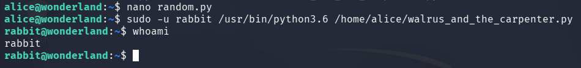

The malicious module was imported with the privileges of `rabbit`, giving me a shell as:

`rabbit`

## PATH Hijacking

Inside Rabbit's home directory, I found a binary called:

`teaParty`

The binary had **SUID permissions** and was owned by root.

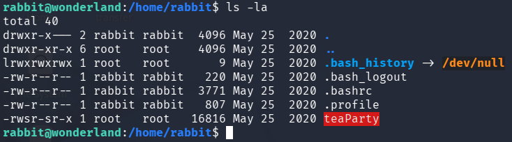

I wanted to inspect the binary to understand what it was doing. Normally, `strings` would be a convenient way to look for readable strings inside a binary, but the machine did not have the `strings` command installed.

Instead of transferring the binary to my own machine, I decided to try reading it with `cat` and looking through the output for anything recognizable.

Surprisingly, this worked.

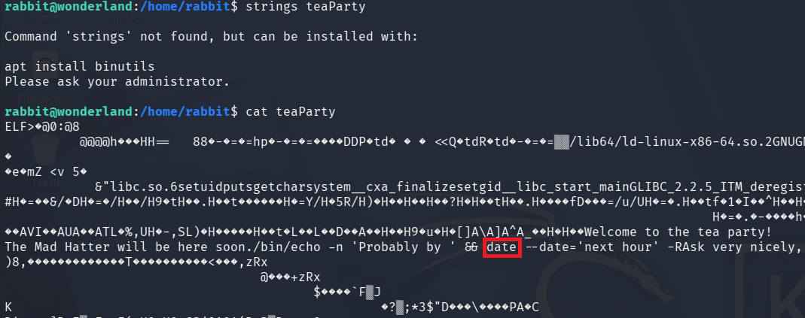

Among the binary's readable strings, I found a command that looked interesting:

```bash
 /bin/echo -n 'Probably by ' && date --date='next hour'
```

The important part was:

```text
date
```

The binary was calling `date` without specifying its absolute path.

This meant I could potentially perform a **PATH hijacking attack** by creating my own malicious `date` executable and placing its directory before the legitimate system paths.

## Exploiting the PATH

I went to `/tmp` and created a file named `date` containing:

```bash
echo "/bin/bash" > date
chmod +x date
```

I then modified my `PATH` so that `/tmp` would be searched first:

```bash
export PATH=/tmp:$PATH
```

I verified that `/tmp` was now at the beginning of my PATH:

```bash
echo $PATH
```

I then returned to Rabbit's directory and executed:

```bash
./teaParty
```

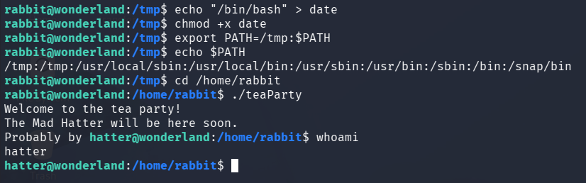

This gave me a shell as:

`hatter`

This initially surprised me because the binary was SUID and owned by root, so I expected the resulting shell to be root.

My understanding is that the SUID binary changes its effective UID to the `hatter` user's UID before reaching the vulnerable `date` call, meaning the malicious command is ultimately executed with `hatter`'s privileges rather than root.

## Getting SSH Access as Hatter

Inside Hatter's home directory, I found a text file containing a password.

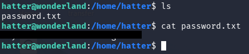

Since I already had the password, there was no reason to continue working through multiple stacked reverse shells.

I used the credentials to connect through SSH as `hatter`.

## Privilege Escalation to Root

Now that I had a stable SSH session as Hatter, it was time to look for a way to escalate to root.

I decided to continue with manual enumeration rather than immediately using LinPEAS.

One of the things I checked was Linux capabilities:

```bash
getcap -r / 2>/dev/null
```

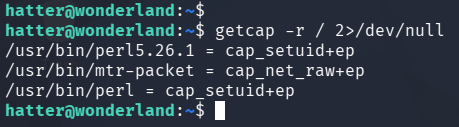

The output revealed that:

`/usr/bin/perl`

had the following capability:

`cap_setuid+ep`

This was interesting because `CAP_SETUID` allows a process to change its UID, bypassing some of the restrictions normally associated with changing user identities.

Since Perl had this capability, I checked GTFOBins for a suitable Perl payload.

## Exploiting CAP_SETUID

I found a payload that uses Perl to change its UID to `0` and then spawn a shell.

From `/usr/bin`, I executed:

```bash
perl -e 'use POSIX qw(setuid); POSIX::setuid(0); exec "/bin/sh"'
```

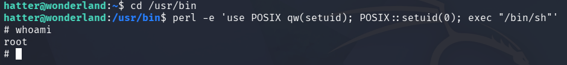

This successfully gave me a root shell.

I could now access the flags, including the `root.txt` file in Alice's home directory and the `user.txt` file under `/root`.

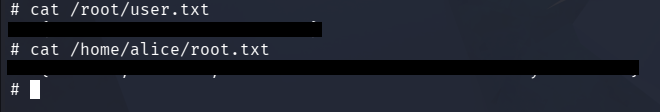

## Conclusion

Wonderland was a good example of how several different Linux privilege escalation techniques can be chained together.

The initial web enumeration led to a hidden directory containing SSH credentials for Alice. From there, a writable Python script directory allowed a **Python library hijacking** attack to obtain a shell as Rabbit. While enumerating Rabbit's environment, I found a root-owned SUID binary vulnerable to **PATH hijacking**, which provided access as Hatter.

Finally, manual capability enumeration revealed that Perl had `CAP_SETUID`, which allowed the UID to be changed to `0` and resulted in a root shell.


